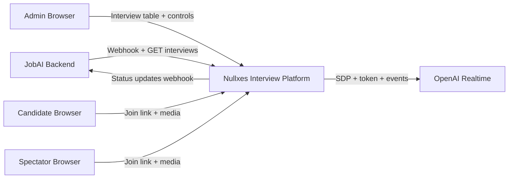
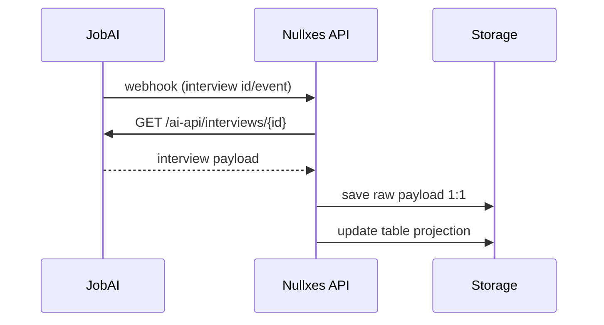
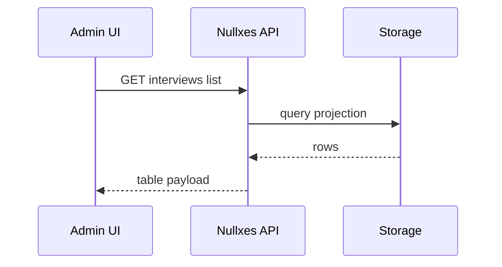
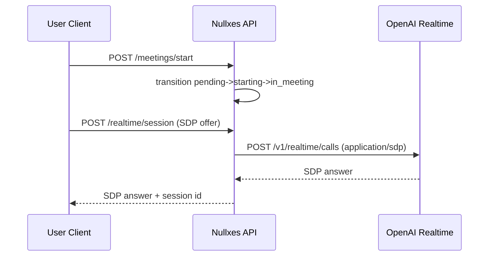
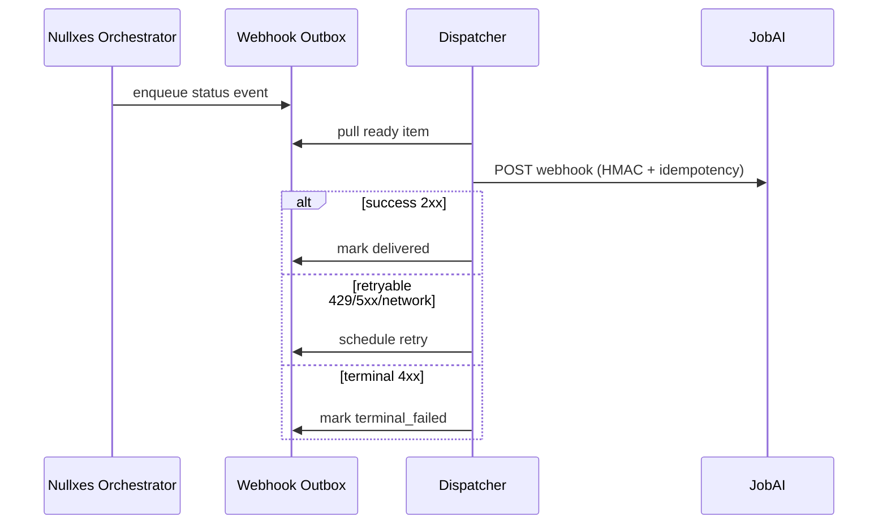

# Nullxes AI Interview Platform - Architecture Overview

## 1. Goal

Build a browser-based interview prototype centered around:
- Nullxes AI realtime interview runtime
- JobAI as the source of interview data
- Interview list/table operations and role-based entry links
- Candidate/spectator media flow validation
- Avatar question execution pipeline

Zoom-specific integration is explicitly out of scope for this version.

## 2. System Context

## 3. Logical Components

### 3.1 API Gateway Layer
- Exposes all HTTP endpoints for:
  - Realtime session and token
  - Meeting orchestration
  - Interview ingestion/sync (JobAI)
  - Interview table queries and details
- Applies basic auth for prototype access.

### 3.2 Interview Domain Service
- Stores interview objects from JobAI as-is (raw payload) and normalized projection for UI table.
- Maintains statuses in two dimensions:
  - `nullxes_status` (internal lifecycle)
  - `jobai_status` (external source-of-truth mirror)

### 3.3 Meeting Orchestrator
- Runs meeting lifecycle:
  - `pending -> starting -> in_meeting -> completed|failed_*|stopped_during_meeting`
- Emits transition events for webhook and internal observability.

### 3.4 Realtime Runtime
- Handles:
  - `POST /realtime/session` (SDP offer/answer gateway)
  - `GET /realtime/token`
  - DataChannel event ingestion/normalization
- Feeds avatar runtime with questions and interview script fragments.

### 3.5 Webhook Delivery Pipeline
- Outbox-based strict delivery to JobAI.
- HMAC signature + idempotency key + retry with backoff.
- Delivery state tracking: pending / delivered / terminal_failed.

### 3.6 Session/Media Coordination
- Candidate and spectator join via signed links.
- Runtime tracks participant role, session binding, and media state checkpoints.
- Video/media checks are runtime validation points, not Zoom implementation.

## 4. Data Model (High-Level)

## 4.1 Interview Aggregate
- `nullxes_id` (internal UUID)
- `jobai_id` (external numeric/string id)
- candidate fields: first/last name (separate, no merge)
- `company_name`
- `meeting_at`
- `nullxes_status`
- `jobai_status`
- `candidate_join_token`
- `spectator_join_token`
- `raw_payload_json` (full JobAI interview payload 1:1)

### 4.2 Meeting Aggregate
- `meeting_id` (equals or links to interview id context)
- `status`
- `trigger_source`
- `session_id` (if bound to realtime session)
- transition history with reason/timestamp

### 4.3 Webhook Delivery Aggregate
- `idempotency_key`
- `event_type`
- `attempt_count`
- `next_attempt_at`
- `last_error`
- `delivery_status`

## 5. Key Flows

## 5.1 JobAI -> Nullxes Interview Ingestion

## 5.2 Admin Table View

## 5.3 Meeting Start + Realtime Binding

## 5.4 Status Webhook to JobAI

## 6. API Surface (Target)

### Existing core
- `GET /health`
- `GET /realtime/token`
- `POST /realtime/session`
- `POST /realtime/session/:sessionId/events`
- `POST /meetings/start`
- `POST /meetings/:meetingId/stop`
- `POST /meetings/:meetingId/fail`
- `GET /meetings/:meetingId`
- `GET /meetings`
- `GET /ops/webhooks`

### Required for interview prototype
- `POST /webhooks/jobai/interviews`
- `POST /sync/jobai/interviews/:id`
- `GET /interviews`
- `GET /interviews/:nullxesId`
- `POST /interviews/:nullxesId/links/candidate`
- `POST /interviews/:nullxesId/links/spectator`
- `GET /join/candidate/:token`
- `GET /join/spectator/:token`

## 7. Runtime/Deployment Topology (Prototype)

- Single Node.js service instance
- In-memory meeting/webhook stores (current)
- Persistent DB for interview list + payload (to be added in next phase)
- Basic Auth in front of UI/API

## 8. Non-Goals for this phase

- Zoom start/join lifecycle integration
- Production-grade multi-region HA
- Enterprise IAM/SSO

## 9. Deliverables for review

- Architecture doc (this file)
- Backlog with milestones and DoD
- API contract draft for interview ingestion/list/links
- Demo сценарии:
  - Interview sync from JobAI
  - Interview list rendering
  - Candidate/spectator link flow
  - Realtime avatar question playback
