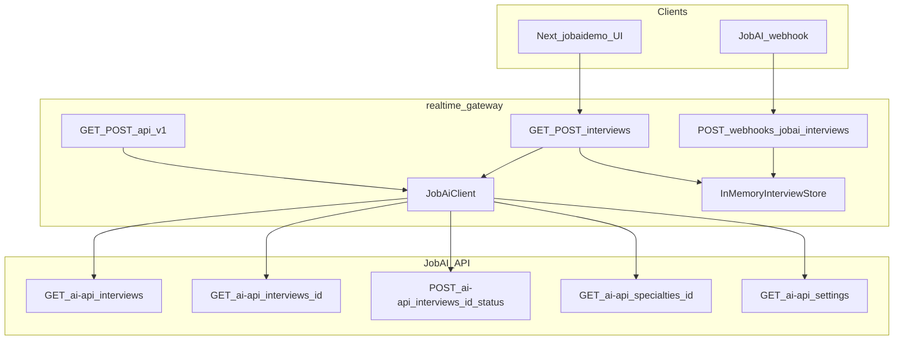

# Gateway и JobAI-интеграция (realtime-gateway)

Node.js **Express + TypeScript** в [backend/realtime-gateway](../backend/realtime-gateway): OpenAI Realtime, встречи (meetings), in-memory интервью JobAI, webhook ingest, алиасы путей ТЗ → JobAI `/ai-api/...`.

## Что сделано

- **OpenAI Realtime**: SDP, токены, события сессии (существующий модуль `/realtime`).
- **Meetings**: старт/stop/fail, webhooks outbox (существующий модуль `/meetings`).
- **Интервью JobAI (Nullxes слой)**:
  - In-memory хранилище: сырой объект интервью (`rawPayload`) + **проекция** для таблицы (имя/фамилия раздельно, пути входа в прототип без Zoom, бизнес-статусы Nullxes).
  - **Webhook** `POST /webhooks/jobai/interviews` — upsert по `interview.id`; опционально секрет в `Authorization` (Bearer или сырое значение) или `x-jobai-ingest-secret` = `JOBAI_INGEST_SECRET`.
  - **Публичный API для UI**: `GET /interviews`, `GET /interviews/:id`, `POST /interviews/:id/status`, `POST /interviews/:id/session-link`, `GET /interviews/:id/entry-paths`, `GET /interviews/source/status`.
  - **Синхронизация** с JobAI: `POST /jobai/sync` (тело `{ skip?, take? }`) и query `GET /interviews?sync=1` — тянет список и по каждому id делает `GET /ai-api/interviews/:id`, upsert полного объекта.
  - **Шаблоны** в ответах списка/детали: `greetingSpeechResolved`, `finalSpeechResolved` (`{{job_title}}`, `{{first_name}}`, `{{company_name}}`).
  - **Бизнес-статусы Nullxes**: ключ + русский лейбл из комбинации статуса JobAI и runtime `nullxesStatus` (см. сервис ниже).
  - **FSM** смены статуса перед вызовом JobAI: `allowedJobAiTransitions` в коде; при 400 от JobAI — JSON-ответ с `details`, не только throw в Express.
- **Алиасы ТЗ** под префиксом **`/api/v1`**: `GET /questions/by_specialty/:id` → JobAI `GET /ai-api/specialties/:id`; `GET /questions/general` → `GET /ai-api/settings` или заглушка; `POST /interviews/:id/cancel` → переход в `canceled` через существующий `POST .../status`.
- **Zoom в прототипе не используется**: поля `zoomJoinUrl` / `zoomStartUrl` из webhook **не** подмешиваются в проекцию как источник ссылок; пути входа только прототипные (`/?jobAiId=`, `/spectator?jobAiId=`).

## Модули и файлы

| Модуль | Путь | Назначение |
|--------|------|------------|
| Сборка приложения | [src/app.ts](../backend/realtime-gateway/src/app.ts) | Роуты: `/realtime`, `/meetings`, `/interviews`, `/api/v1`, `/`, `/health`, `/ops/webhooks` |
| Конфиг | [src/config/env.ts](../backend/realtime-gateway/src/config/env.ts) | Zod: OpenAI, JobAI API, ingest, webhooks outbox |
| Типы интервью | [src/types/interview.ts](../backend/realtime-gateway/src/types/interview.ts) | `JobAiInterview`, `InterviewProjection`, FSM `allowedJobAiTransitions`, `NullxesBusinessKey` |
| JobAI HTTP | [src/services/jobaiClient.ts](../backend/realtime-gateway/src/services/jobaiClient.ts) | Base URL, Basic/Bearer auth, CRUD вызовы `/ai-api/...` |
| Хранилище | [src/services/interviewStore.ts](../backend/realtime-gateway/src/services/interviewStore.ts) | Map по `jobAiId`, upsert, список, session-link, sync meta |
| Сервис синка | [src/services/interviewSyncService.ts](../backend/realtime-gateway/src/services/interviewSyncService.ts) | Ingest, sync, transitionStatus, cancelInterview, unwrap webhook |
| Бизнес-статусы | [src/services/nullxesBusinessStatus.ts](../backend/realtime-gateway/src/services/nullxesBusinessStatus.ts) | `resolveNullxesBusiness(jobAiStatus, nullxesRuntime)` |
| Шаблоны | [src/services/templateInterpolation.ts](../backend/realtime-gateway/src/services/templateInterpolation.ts) | `applyInterviewTemplates` |
| Сериализация API | [src/services/interviewSerialization.ts](../backend/realtime-gateway/src/services/interviewSerialization.ts) | List + detail DTO с resolved полями |
| Роут интервью | [src/routes/interviews.routes.ts](../backend/realtime-gateway/src/routes/interviews.routes.ts) | Публичные эндпойнты для UI |
| Роут webhook/sync | [src/routes/jobai.routes.ts](../backend/realtime-gateway/src/routes/jobai.routes.ts) | Webhook ingest, `POST /jobai/sync` |
| Алиасы ТЗ | [src/routes/tzAlias.routes.ts](../backend/realtime-gateway/src/routes/tzAlias.routes.ts) | `/api/v1/questions/*`, cancel |
| Realtime / meetings | `src/routes/realtime.routes.ts`, `meeting.routes.ts` + orchestrator/store | Без изменений по смыслу интеграции JobAI |

## Схема данных (бэкенд)

### Сырой объект (`rawPayload`)

Соответствует контракту JobAI (как `GET /ai-api/interviews/{id}`). В webhook по ТЗ могут **отсутствовать**: `zoomJoinUrl`, `zoomStartUrl`, `videoFilename`, `audioFilename`, `speechText` — в хранилище они остаются `undefined`/`null`, **не** заполняются из других полей и **не** подтягиваются специально для Zoom.

### Проекция (`InterviewProjection`)

Используется в `GET /interviews` (через сериализацию) и внутри `GET /interviews/:id`:

- Идентификаторы: `jobAiId`, опционально `nullxesMeetingId`, `sessionId`.
- Кандидат: `candidateFirstName`, `candidateLastName`, `companyName`, `meetingAt`.
- Статусы: `jobAiStatus`, `nullxesStatus` (`idle` | `in_meeting` | `completed` | `stopped_during_meeting` | `failed`).
- Вход в прототип (не Zoom): `candidateEntryPath` (`/?jobAiId=<id>`), `spectatorEntryPath` (`/spectator?jobAiId=<id>`).
- UI: `nullxesBusinessKey`, `nullxesBusinessLabel` (человекочитаемо).
- `updatedAt`.

### FSM JobAI (локальная проверка перед `POST /ai-api/interviews/:id/status`)

Задано в `allowedJobAiTransitions` в [types/interview.ts](../backend/realtime-gateway/src/types/interview.ts), включая статус `meeting_not_started`. Реальный JobAI может ещё менять правила — при расхождении приходит 400 от апстрима.

## Кто куда ходит

## HTTP-поверхность (кратко)

| Метод | Путь | Назначение |
|-------|------|------------|
| POST | `/webhooks/jobai/interviews` | Ingest webhook |
| POST | `/jobai/sync` | Синк из JobAI в store |
| GET | `/interviews?skip&take&sync` | Список для UI |
| GET | `/interviews/source/status` | Статус интеграции + sync meta |
| GET | `/interviews/:id` | Деталь + проекция |
| GET | `/interviews/:id/entry-paths` | Пути входа прототипа |
| POST | `/interviews/:id/status` | Смена статуса в JobAI (после локальной FSM) |
| POST | `/interviews/:id/session-link` | Привязка `meetingId` / `sessionId` |
| GET | `/api/v1/questions/by_specialty/:id` | Прокси specialty |
| GET | `/api/v1/questions/general` | Settings или заглушка |
| POST | `/api/v1/interviews/:id/cancel` | Отмена через статус `canceled` |

Плюс существующие `/realtime/*`, `/meetings/*`, `/health`, `/ops/webhooks`.

## Переменные окружения (бэкенд, JobAI / ingest)

См. [src/config/env.ts](../backend/realtime-gateway/src/config/env.ts). Важное для интеграции:

| Переменная | Назначение |
|------------|------------|
| `JOBAI_API_BASE_URL` | Например `https://back.dev.job-ai.ru` |
| `JOBAI_API_AUTH_MODE` | `none` \| `bearer` \| `basic` |
| `JOBAI_API_TOKEN` / `JOBAI_API_BASIC_USER` + `JOBAI_API_BASIC_PASSWORD` | Доступ к JobAI API |
| `JOBAI_INGEST_SECRET` | Если задан — проверка webhook (Authorization или `x-jobai-ingest-secret`) |

OpenAI и webhooks Nullxes → заказчик (существующие `JOBAI_WEBHOOK_*` для **исходящих** webhooks встреч) описаны в том же `env.ts`.

## Связанный документ

- Фронт и прокси: [docs/frontend.md](frontend.md)
