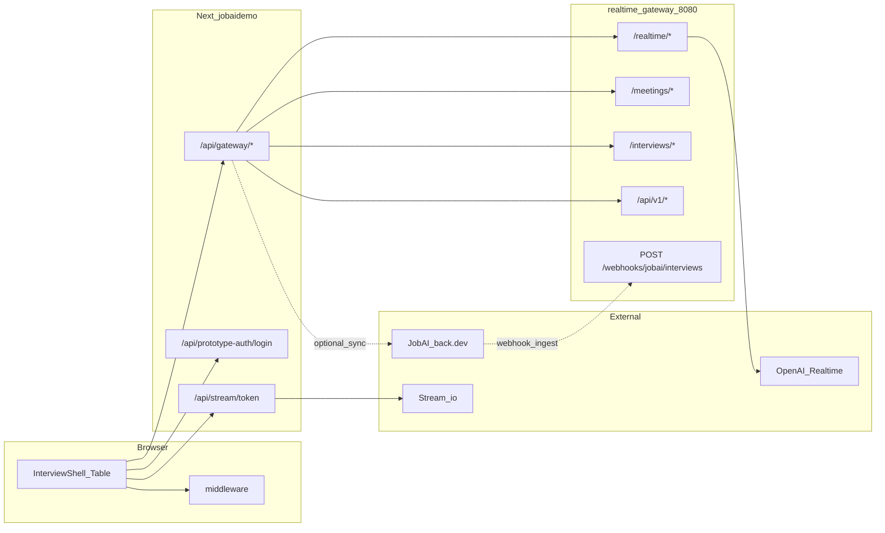

# Прототип фронтенда (jobaidemo)

Next.js 16 приложение в каталоге [frontend/jobaidemo](../frontend/jobaidemo). Страница интервью, прокси к локальному gateway, Stream Video, защита прототипа по cookie/Basic.

## Что сделано

- Экран интервью: шапка, три колонки (кандидат Stream, HR avatar Stream, наблюдатель-заглушка), блок JobAI source, скрипт аватара, таблица собеседований.
- **Авторизация прототипа**: middleware + форма `/login` + cookie-сессия; опционально вход по заголовку `Authorization: Basic` (для curl/прокси).
- **API-клиент** к своему бэкенду через Next Route Handler `GET/POST/PUT/PATCH/DELETE /api/gateway/*` → `BACKEND_GATEWAY_URL` (по умолчанию `http://localhost:8080`).
- **Таблица интервью**: колонки ID Nullxes / JobAI, имя и фамилия отдельно, компания, `meetingAt`, бизнес-статус Nullxes (лейбл с бэка), сырой статус JobAI; кнопки «Справочно» (модалка: вакансия, приветствие/прощание с подстановками с бэка, вопросы specialty), копирование ссылок на **вход в прототип** (без Zoom): `/?jobAiId=…` и `/spectator?jobAiId=…`, открытие наблюдателя в новой вкладке.
- **Deep link**: query `?jobAiId=<number>` на главной выделяет строку и подгружает детали.
- **Страница** `/spectator`: заглушка с пояснением (Stream + meetingId на главной), без Zoom.

## Модули и файлы

| Область | Путь | Назначение |
|--------|------|------------|
| Точка входа UI | [app/page.tsx](../frontend/jobaidemo/app/page.tsx) | `Suspense` + `InterviewShell` |
| Логин | [app/login/page.tsx](../frontend/jobaidemo/app/login/page.tsx) | Форма → `POST /api/prototype-auth/login` |
| Наблюдатель | [app/spectator/page.tsx](../frontend/jobaidemo/app/spectator/page.tsx) | `Suspense` + контент по `jobAiId` |
| Защита маршрутов | [middleware.ts](../frontend/jobaidemo/middleware.ts) | Cookie `prototype_session` или Basic; публично `/login`, `/api/prototype-auth/*`, статика |
| Сессия cookie | [lib/prototype-auth-cookie.ts](../frontend/jobaidemo/lib/prototype-auth-cookie.ts) | HMAC-подпись payload (Web Crypto) |
| Учётки | [lib/prototype-auth-users.ts](../frontend/jobaidemo/lib/prototype-auth-users.ts) | Разбор `PROTOTYPE_BASIC_AUTH` / single user+pass |
| Логин API | [app/api/prototype-auth/login/route.ts](../frontend/jobaidemo/app/api/prototype-auth/login/route.ts) | Проверка пароля, `Set-Cookie` |
| Logout API | [app/api/prototype-auth/logout/route.ts](../frontend/jobaidemo/app/api/prototype-auth/logout/route.ts) | Сброс cookie |
| Прокси на gateway | [app/api/gateway/[...path]/route.ts](../frontend/jobaidemo/app/api/gateway/[...path]/route.ts) | Проброс метода/тела/query на бэкенд |
| HTTP к gateway | [lib/api.ts](../frontend/jobaidemo/lib/api.ts) | `requestJson` с `credentials: "include"`; типы списка/детали; realtime/meetings/interviews |
| WebRTC | [lib/webrtc-client.ts](../frontend/jobaidemo/lib/webrtc-client.ts) | SDP к `/realtime/session`, события |
| Сессия интервью | [hooks/use-interview-session.ts](../frontend/jobaidemo/hooks/use-interview-session.ts) | Старт/stop meeting, RTC, привязка к `jobAiId`, вызовы `linkInterviewSession` / `updateInterviewStatus` |
| Оболочка | [components/interview/interview-shell.tsx](../frontend/jobaidemo/components/interview/interview-shell.tsx) | Загрузка списка/детали, `jobAiId` из URL, шапка/таблица/скрипт |
| Таблица | [components/interview/interviews-table-preview.tsx](../frontend/jobaidemo/components/interview/interviews-table-preview.tsx) | Модалка справки, ссылки прототипа |
| Шапка | [components/interview/meeting-header.tsx](../frontend/jobaidemo/components/interview/meeting-header.tsx) | `prototypeEntryUrl` (origin + `candidateEntryPath`) |
| Stream кандидат | [components/interview/candidate-stream-card.tsx](../frontend/jobaidemo/components/interview/candidate-stream-card.tsx) | Токен `/api/stream/token` с `credentials`, Join Stream → `start()` |
| Stream аватар | [components/interview/avatar-stream-card.tsx](../frontend/jobaidemo/components/interview/avatar-stream-card.tsx) | Тот же `callId` что `meetingId` |

## Схемы данных (фронт)

Типы в [lib/api.ts](../frontend/jobaidemo/lib/api.ts) (сокращённо):

- `InterviewListRow` — поля проекции с бэка: `jobAiId`, `nullxesMeetingId`, `sessionId`, `candidateFirstName`, `candidateLastName`, `candidateEntryPath`, `spectatorEntryPath`, `nullxesBusinessKey`, `nullxesBusinessLabel`, `companyName`, `meetingAt`, `jobAiStatus`, `nullxesStatus`, `updatedAt`, `createdAt`, `statusChangedAt`, опционально `greetingSpeechResolved` / `finalSpeechResolved`.
- `InterviewDetail` — `{ interview: { …, greetingSpeechResolved?, finalSpeechResolved? }, projection: InterviewListRow }`.
- `JobAiInterviewStatus`, `NullxesBusinessKey`, `NullxesRuntimeStatus` — зеркало бэкенд-логики для TypeScript.

## Кто куда ходит

- Пользователь открывает сайт → middleware проверяет cookie или Basic → при отсутствии редирект на `/login`.
- После логина cookie уходит на все `fetch` с `credentials: "include"` к `/api/gateway/...` и к `/api/stream/token`.
- **JobAI** с браузера напрямую не вызывается: только через gateway (`/interviews?sync=1`, детали, статус, алиасы `/api/v1/...` при необходимости).

## Переменные окружения (фронт)

| Переменная | Назначение |
|------------|------------|
| `BACKEND_GATEWAY_URL` | База для прокси `/api/gateway/*` (по умолчанию `http://localhost:8080`) |
| `STREAM_API_KEY`, `STREAM_SECRET_KEY` | Для [app/api/stream/token/route.ts](../frontend/jobaidemo/app/api/stream/token/route.ts) |
| `PROTOTYPE_BASIC_AUTH` | Список `user:pass,user2:pass2` |
| `PROTOTYPE_BASIC_USER` / `PROTOTYPE_BASIC_PASSWORD` | Одна пара, если не используется multi |
| `PROTOTYPE_SESSION_SECRET` | Минимум 16 символов; подпись cookie (обязательно, если включена защита) |

Если не заданы учётки **или** секрет — middleware **не** блокирует (удобно для локальной разработки).

## Связанный документ

- Бэкенд и ingest: [docs/backend.md](backend.md)
